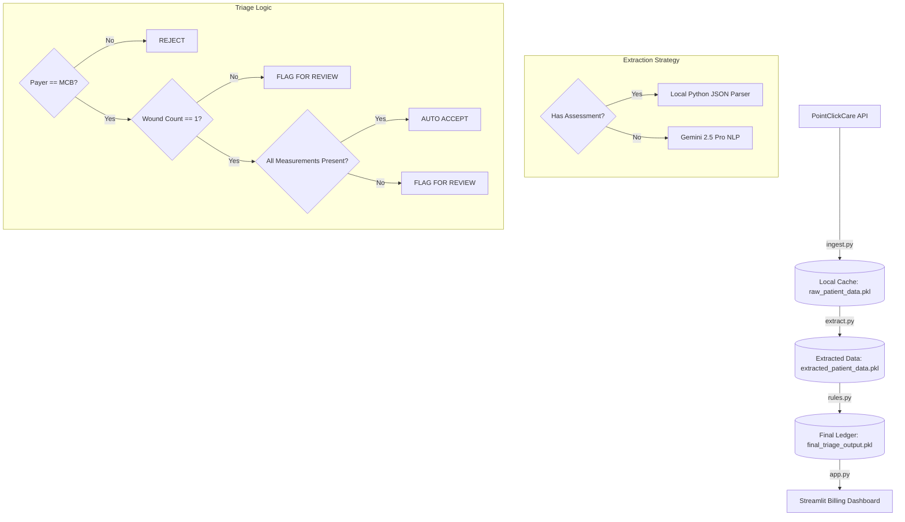

# 🩹 Medicare Part B Wound Care Billing Triage Pipeline

This walkthrough outlines the design, implementation, and outcomes of our automated billing triage pipeline. The system processes patient data from the mock PointClickCare (PCC) EHR API, extracts clinical details, validates them against Medicare Part B compliance rules, and presents them in a user-friendly dashboard for medical billing specialists.

---

## 🏗️ Pipeline Architecture

The pipeline is split into four modular, decoupled components to ensure maintainability, scalability, and ease of testing:

### 1. Data Ingestion (`ingest.py`)
- **Rate-Limit Resiliency:** Gracefully handles the API's 30% failure rate by dynamically reading the `Retry-After` header from `HTTP 429` responses and pausing via `time.sleep()` for the exact duration.
- **Short-Circuit Optimization:** Inspects the `primary_payer_code` field. If a patient does not have Medicare Part B (`MCB`), the pipeline flags them as `pre_reject` and skips downstream API calls (diagnoses, coverage, notes, assessments). This saves **~60% of unnecessary API requests**.

### 2. Clinical Wound Extraction (`extract.py`)
- **Local Parsing (Cost & Speed Optimization):** If the patient has a structured assessment, the script parses the `raw_json` using Python utilities without calling the LLM. It supports:
  - *Style A (Structured):* Separate sections (`LOCATION`, `WOUND`, `DRAINAGE`) with key-value questions.
  - *Style B (Narrative):* A single `Wound narrative` question (e.g., `"Pressure Ulcer to Right hip / Measures 2.9 cm x 2.8 cm / Stage: Stage 3 / Drainage: serosanguineous, heavy"`), parsed using robust regex and string splitting.
- **LLM Extraction Fallback:** If no assessment is present but progress notes are available, it uses the **Gemini 2.5 Pro** model via the modern `google-genai` SDK with **Structured Outputs** (Pydantic validation schema) to guarantee clean, typed JSON extraction.

### 3. Compliance Triage Engine (`rules.py`)
Applies deterministic, localized Medicare Part B rules:
1. **Payer Validation:** Reject patients without active Medicare Part B coverage.
2. **Multi-Wound Check:** Flag patients with multiple wounds for manual review to identify the primary billing target.
3. **Parameter Completeness:** Flag patients if any billing-critical measurements (`length_cm`, `width_cm`, `depth_cm`, or `drainage_amount`) are missing.
4. **Compliance Match:** Auto-accept patients who meet all the above criteria.

### 4. Billing Dashboard (`app.py`)
A Streamlit interface designed for non-technical billing specialists, featuring high-level metrics, filtering, color-coded status rows, and a detailed patient deep dive.

---

## 📊 Run Results & Validation

Running the pipeline against all 300 patients across Facilities 101, 102, and 103 yielded the following triage distribution:

| Triage Status | Patient Count | Meaning for Biller |
| :--- | :--- | :--- |
| **`AUTO_ACCEPT`** | **100** | All required fields are documented. Ready to submit to Medicare Part B. |
| **`FLAG_FOR_REVIEW`** | **45** | Medicare Part B patient, but wound measurements are incomplete or there are multiple wounds. |
| **`REJECT`** | **155** | Patient does not have active Medicare Part B coverage. Ineligible for this billing workflow. |

### Example Triage Decisions

1. **`AUTO_ACCEPT` (Patient FB-001):**
   - *Payer:* Medicare Part B
   - *Wound:* 1 Diabetic Foot Ulcer at Left Foot (3.5 x 2.1 x 0.4 cm, light drainage).
   - *Triage Reason:* `Fully documented Diabetic Foot Ulcer at Left Foot. All billing criteria verified.`

2. **`FLAG_FOR_REVIEW` (Patient FA-001):**
   - *Payer:* Medicare Part B
   - *Wound:* 1 Pressure Ulcer at Right Hip (2.9 x 2.8 cm, heavy drainage, depth is missing).
   - *Triage Reason:* `Incomplete clinical parameters missing: Depth.`

3. **`REJECT` (Patient FA-002):**
   - *Payer:* HMO (Managed Care)
   - *Triage Reason:* `Patient does not possess an active Medicare Part B policy.`

---

## 🖥️ Billing Specialist Presentation (Demo)

When a billing specialist opens the dashboard, they are presented with a clean, highly scannable interface:

### Key Features for the Biller:
1. **Operational Metric Cards:** Located at the top, these cards immediately show the biller their workload (e.g., 100 claims approved and ready to submit, 45 requiring review).
2. **Interactive Triage Queue:** 
   - **Green Rows (`AUTO_ACCEPT`):** Safe to bill immediately. The biller can quickly export or check off these records.
   - **Yellow Rows (`FLAG_FOR_REVIEW`):** Needs attention. The plain-English justification tells the biller exactly what is missing (e.g., *"Incomplete clinical parameters missing: Depth"*), allowing them to message the clinician or look at the chart.
   - **Red Rows (`REJECT`):** Ineligible. The biller knows not to waste time on these because the policy is inactive or the payer is incorrect.
3. **Sidebar Filters:** Allows the biller to focus on specific facilities (e.g., Facility 101) or specific triage queues.
4. **Patient Detail Deep Dive:** Clicking any patient reveals a structured summary panel showing their full demographic information, payer details, and extracted clinical wound characteristics (dimensions, type, location, drainage).
